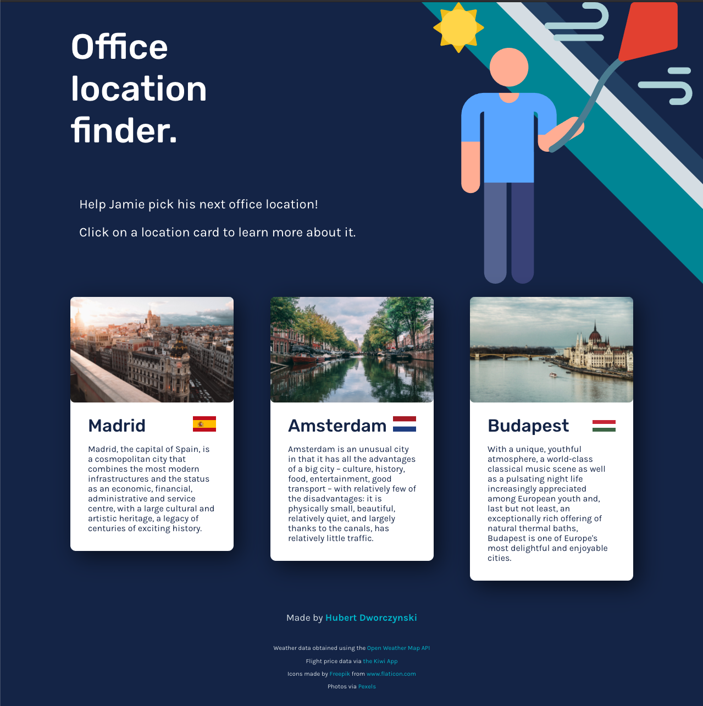
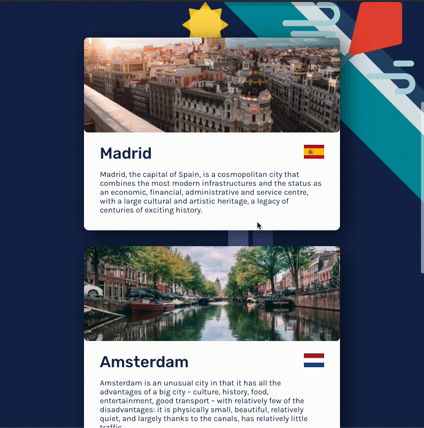

# Office location finder

The user is presented with cards representing suggested office locations.
When a card is clicked, a modal opens revealing more data about the location.

## About the app

- Simple React App using TypeScript, scss, react-spring, and axios.
- Google Lighthouse score of 82/100/100/100.
- Uses modern functional React with component logic extracted into custom hooks.
- Network layer is handled with `useAxios` hooks.
- Secure: the app is deployed using now.sh and the API key for OpenWeatherMap is stored in an encrypted remote store using environment variables
- Idiomatic and responsive styles using BEM, scss variables and mixins for media queries.
- Automatic code formatting using prettier and a pre-commit git hook.
- Automatic deployments via GitHub integration with Vercel.

There are two main sources of information:

1. Travel cost (Using the skypicker API):

- The flight cost from Amsterdam/Madrid/Budapest to 3 destinations: London, Paris & New York.
- For simplicity, the app fetches the next 10 upcoming flights, and picks the most affordable one out of these.
- When clicking the price, the user is redirected to the flight page.

2. Weather

- Static climate data
- Current weather (using the OpenWeatherMap API)

## Running the app

1. Add the OpenWeatherMap API key in the `.env.local` file.
2. `yarn install`
3. `yarn start`

## THINGS TO IMPROVE (if I had more time ;) )

- Type definitions for some external dependencies (rodal, useAnimation) should be improved.
- Caching can be enabled without extra effort by enabling the service worker. I decided not to do this for this assignment.
- More data could be added to help Jamie make his decision.
- If the app was to grow and become more complex, a state management library like Redux or Recoil.js could be used.
- Unit tests can be added.
